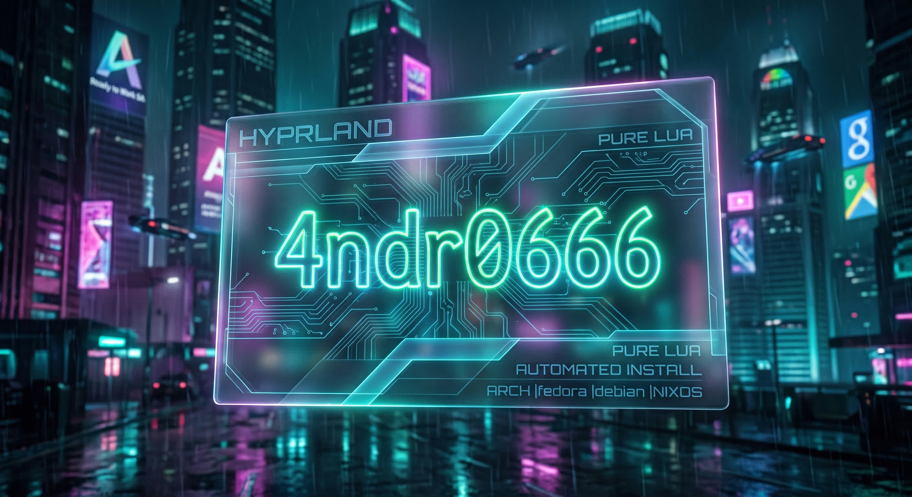

<p align="center">
  <a href="banner.jpeg"></a>
  <a href="https://raw.githubusercontent.com/4ndr0666/ars0n-framework-v2-pi/refs/heads/pi-support/assets/badge_build.png"></a>
  <a href="https://raw.githubusercontent.com/4ndr0666/ars0n-framework-v2-pi/refs/heads/pi-support/assets/badge_license.png"></a>
</p>

<h1 align="center">4NDR0666OS Hyprland Installer</h1>
<p align="center">Arch-optimized, multi-Linux distro ready, and reproducible. Hyprland 55+, lua resilient provisioned, and a frictionless “it just works” deployment experience. Pure lua spec by default, and customised terminal independent scratchpad.</p>

<p align="center">
  ⊰💀•-⦑4NDR0666OS⦒-•💀⊱
</p>

---

Welcome to the unified, purely Lua-driven ecosystem for the Hyprland compositor. This repository houses a single, integrated monorepo tree containing the baseline environment configurations, asset banks, orchestration layer, and modular installer scripts.

---

### 🚩 Automated Installer Bootstrapping

For a reproducible setup sequence, use the commit-pinned bootstrap procedure documented in [`docs/BOOTSTRAP.md`](docs/BOOTSTRAP.md). Do not execute `Distro-Hyprland.sh` from mutable `main`.

The documented procedure pins the bootstrap to the repository's reviewed `release.ref`, after which the bootstrap itself verifies the exact installer revision before execution.

---

### 🏛️ Supported Distributions & Environments

Automated installation, compilation, and setup handlers are engineered explicitly to parse variables and provision dependencies across the following host platforms:

* **Arch Linux** (Using native package arrays and localized helper systems)
* **openSUSE** (Tumbleweed architectures)
* **Fedora Linux** (Version 43, Rawhide, and development targets)
* **Debian GNU/Linux** (Trixie and SID rolling distributions)
* **NixOS** (Version 25.05 and newer configuration channels)
* **Ubuntu Linux** (Version 24.04 LTS, 25.10, and rolling tracking branches)

---

### 📦 Project Scope and Manifest Guidelines

* **Package Constraints:** This framework behaves exclusively as a declarative configuration manifest and user space setup matrix. It does not handle standalone low-level package distribution.
* **Display Baseline:** By default, layout parameters, viewport measurements, and internal render tables are optimized for high-density 2K (1440p) targets without hardware scaling flags enabled.

---

### 🚀 Installation and Deployment

The primary orchestration layer uses a non-destructive copy pipeline to transfer assets while maintaining persistent user overrides.

```bash
# Clone the monorepo tree
git clone --depth=1 https://github.com/4ndr0666/4ndr0666_hyprland.git
cd 4ndr0666_hyprland

# Provide execution privileges to the main copy harness
chmod +x copy.sh
./copy.sh

```

#### Available Deployment Targets

* **Fresh Copy / Upgrade Sync (`./copy.sh`):** Iterates through active data components, provisions baseline definitions, and establishes persistent overlays. Old configurations are moved gracefully to timestamped backups under `~/.config/`.
* **Stable Releases (`./release.sh`):** Downloads and processes explicitly tagged source distributions straight from targeted releases.
* **Semi-Manual Sync (`./upgrade.sh`):** Leverages internal file checking pipelines and custom exclusion models to synchronize configuration components across active running instances.

---

### 🛠️ Mandatory Initialization Steps

To establish absolute environment continuity and bypass potential initialization warnings:

1. **Wallpaper Mapping:** Upon your initial login, invoke the dynamic layout daemon panel with `SUPER + W` to select an environment background. This process compiles your targeted dynamic material palette via Wallust and hot-reloads corresponding background templates for Kitty, Waybar, and Rofi modules.
2. **GPU Optimization:** Systems powered by hardware acceleration pipelines or discrete graphics nodes must adapt configuration elements explicitly inside `config/hypr/UserConfigs/ENVariables.lua` to lift constraint behaviors.

---

### ⚙️ Architecture Overview

The configuration footprint features an advanced, refactored design driven entirely by modular Lua orchestration rules, systematically eliminating legacy `.conf` files:

```text
.
├── archive/                                     # System upgrade and tracking manifests
├── assets/                                      # Monorepo artwork assets
├── config/
│   ├── btop/                                    # System resource metrics
│   ├── cava/                                    # Audio visualization profiles
│   ├── fastfetch/                               # Environment statistics layout
│   ├── ghostty/                                 # Terminal layouts
│   ├── hypr/                                    # Pure Lua Core compositor settings
│   │   ├── animations/                          # Structural window preset models
│   │   ├── configs/                             # Default keybinds, startup routines, and system settings
│   │   ├── Monitor_Profiles/                    # Declarative monitor configuration arrays
│   │   ├── scripts/                             # Runtime helper and workspace utilities
│   │   └── UserConfigs/                         # User-managed state overrides and variables
│   ├── kitty/                                   # Main virtual terminal configs
│   ├── quickshell/                              # System overview widget layers
│   ├── rofi/                                    # Program menus and semantic launchers
│   ├── swaync/                                  # Notification control setups
│   ├── wallust/                                 # Color space template engines
│   └── waybar/                                  # Status navigation modules
├── install-scripts/                             # Component provisioning files
├── copy.sh                                      # Main data migration harness
└── Distro-Hyprland.sh                           # Host detection and bootstrap pipeline

```

---

### ⌨️ Key Bindings

| Key Combination | Targeted Execution Event |
| --- | --- |
| `SUPER + Return` | Open main terminal instance (`kitty`) |
| `SUPER + D` | Launch semantic application and menu routing overlay (`rofi`) |
| `SUPER + Q` | Terminate active layout viewport safely |
| `SUPER + X` | Invoke environment session state panel (`wlogout`) |
| `SUPER + W` | Trigger localized wallpaper orchestration framework |
| `SUPER + A` | Toggle desktop workspace component overview |
| `SUPER + SPACE` | Toggle window float parameters |
| `SUPER + Shift + F` | Switch window states into true fullscreen mode |
| `SUPER + Alt + R` | Force hot-reload across active layouts and menus |

---

### 🤝 Contributing

Contributions to further optimize execution profiles, refine modular routines, or expand translation indices across this unified architecture are welcome. Please ensure your contributions comply with layout schema updates, strict scoping, and maintain clean separation of layout properties.
